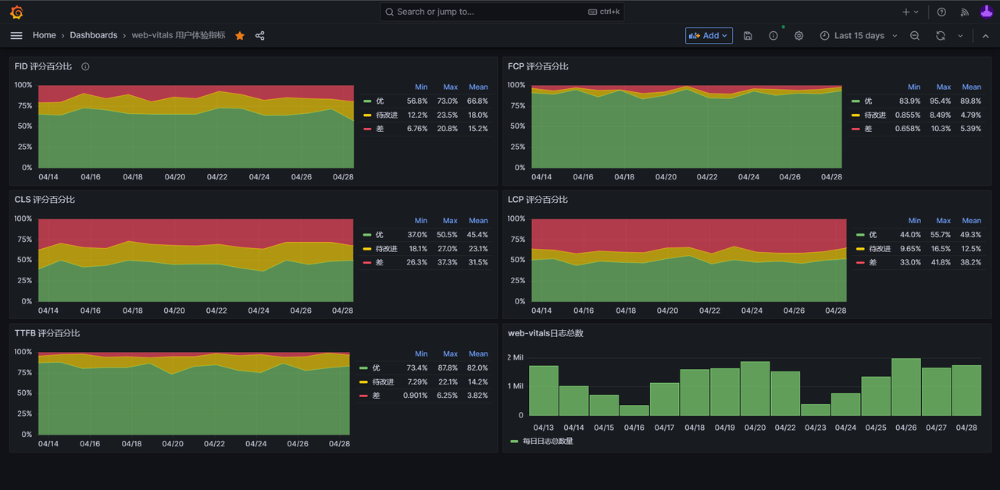

# node-prometheus-grafana-demo
> 作者: https://github.com/JuniorTour
《现代前端工程体验优化》目录

第一章、数据驱动，指标先行
- 第一节：[《数据驱动，监控先行》](https://juejin.cn/user/4142615542378824/posts)
- 第二节：[《用户体验数据收集与可视化：基于 Prometheus 及 Grafana 的实现简介》](https://juejin.cn/post/7229899772769140773#heading-0)
第二章、用户体验优化
第三章、开发体验优化
第四章、制度建设
第五章、持续集成：用自动化工具保持优化效果

## DEMO


## 本地开发指南
``` shell script
npm install
npm run start
```
